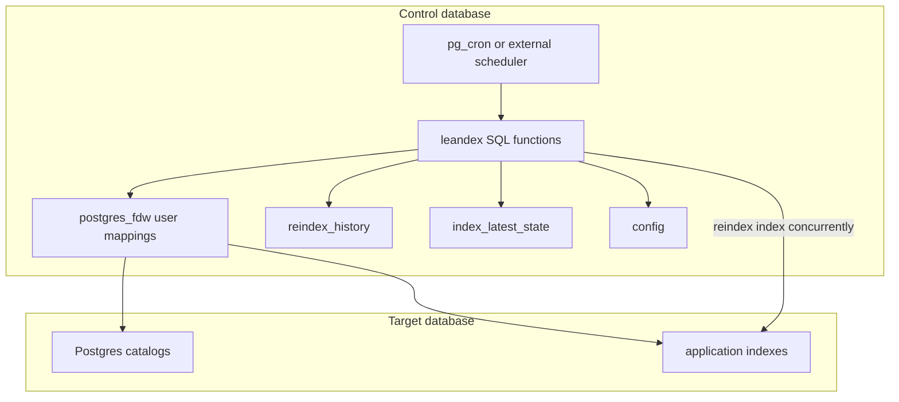

# leandex

[](https://github.com/NikolayS/leandex/actions/workflows/ci.yml)
[](https://github.com/NikolayS/leandex)
[](LICENSE)
[](https://github.com/NikolayS/leandex)

Keep Postgres indexes lean: detect bloat, rebuild safely, and keep a durable history of reindexing.

**The anti-extension, anti-daemon path for index maintenance.** `leandex` is a pure SQL / PL/pgSQL control plane for conservative autonomous reindexing, in the same extension-avoidance spirit as [`pg_ash`](https://github.com/NikolayS/pg_ash) and [`PgQue`](https://github.com/NikolayS/pgque). It installs into a separate control database, talks to target databases through `postgres_fdw` user mappings and `dblink`, and rebuilds only with `reindex index concurrently`. No schema is installed into target databases. No C extension, no `shared_preload_libraries`, no sidecar worker, no restart.

The production target is deliberately narrow: **safe automatic reindexing**. `leandex` does not drop indexes and does not suggest new indexes.

## Contents

- [Why leandex](#why-leandex)
- [What leandex does](#what-leandex-does)
- [What leandex refuses to do](#what-leandex-refuses-to-do)
- [Quick start](#quick-start)
- [First dry run](#first-dry-run)
- [Safety model](#safety-model)
- [Comparison](#comparison)
- [How it works](#how-it-works)
- [Configuration](#configuration)
- [Scheduling](#scheduling)
- [Operations cookbook](#operations-cookbook)
- [Managed Postgres notes](#managed-postgres-notes)
- [Acknowledgements](#acknowledgements)
- [Contributing](#contributing)
- [Documentation](#documentation)
- [Uninstall](#uninstall)
- [Status](#status)
- [License](#license)

## Why leandex

Index bloat is boring until it quietly taxes every expensive part of Postgres: buffer cache, storage, IO, backup size, replica lag, failover time, and maintenance windows. Manual reindexing works for one database. It does not scale across fleets. Naive automation is worse: it can block application traffic, forget history, reindex the wrong thing, or hide what it did.

`leandex` is the conservative middle ground:

- find indexes whose size drifted far above their baseline;
- rebuild them with Postgres' concurrent reindex machinery;
- keep durable state and history in Postgres;
- let operators inspect, dry-run, pause, schedule, and audit the whole thing.

This is DBA automation, not a magic index advisor. It automates the maintenance task that should be boring, and it leaves the sharp product decisions to humans and separately gated tools.

## What leandex does

- Detects index bloat with a lightweight baseline-ratio method.
- Rebuilds eligible indexes using `reindex index concurrently`.
- Stores latest observed index state in `leandex.index_latest_state`.
- Stores every rebuild attempt in `leandex.reindex_history`.
- Runs from a separate control database, typically `leandex_control`.
- Supports multiple target databases from one control database.
- Uses `postgres_fdw` user mappings instead of plaintext dblink connection strings.
- Can be scheduled with `pg_cron` or any external scheduler.
- Works without installing schemas, tables, or functions into target databases.

## What leandex refuses to do

`leandex` does **not**:

- drop indexes;
- suggest missing indexes;
- create replacement indexes;
- rewrite table storage;
- require superuser-only C extensions;
- install anything into target application databases.

That separation is intentional. Index creation and deletion are sharp knives. Mixing them into automatic reindexing would make the safety story muddy.

## Quick start

Requirements:

- Postgres 13 or newer.
- A control database, for example `leandex_control`.
- Extensions in the control database:
  - `postgres_fdw`
  - `dblink`
  - `pg_cron` optional, only for in-database scheduling.
- A role with enough privileges on target databases to inspect indexes and run `reindex index concurrently` on target indexes.

Install and register one target:

```bash
git clone https://github.com/NikolayS/leandex.git
cd leandex

createdb -h your_host -U your_user leandex_control
psql -h your_host -U your_user -d leandex_control
```

Inside `psql`, install the single-file schema:

```sql
create extension if not exists postgres_fdw;
create extension if not exists dblink;
\i leandex.sql
```

Create the FDW server, user mapping, and target registration from the same `psql` session:

```sql
create server target_your_database
  foreign data wrapper postgres_fdw
  options (host 'your_host', port '5432', dbname 'your_database');

create user mapping for current_user
  server target_your_database
  options (user 'your_user', password 'your_password');

insert into leandex.target_databases(database_name, host, port, fdw_server_name, enabled)
values ('your_database', 'your_host', 5432, 'target_your_database', true)
on conflict (database_name) do update
  set
    host = excluded.host,
    port = excluded.port,
    fdw_server_name = excluded.fdw_server_name,
    enabled = true;
```

Verify from SQL:

```sql
select * from leandex.check_fdw_security_status();
select * from leandex.check_environment();
```

Expected verification signals include:

```text
Overall security status | SECURE
Control DB: registered targets | t | your_database
FDW self-connection test | t | Connected via user mapping
```

Prefer `.pgpass`, `PGPASSWORD`, or a protected secret store over command-line passwords. Command-line passwords leak through shell history and process listings. Ask me how I know. Actually, don't.

### Single-file SQL install

Use `psql` directly:

```bash
createdb -h your_host -U your_user leandex_control
psql -h your_host -U your_user -d leandex_control
```

Then from `psql`:

```sql
create extension if not exists postgres_fdw;
create extension if not exists dblink;
\i leandex.sql
```

`leandex.sql` is the installation artifact. The split SQL files are for development and reviewable diffs.

## First dry run

Start with inventory and dry-run behavior. Do not point a new automation loop at a hot production fleet and walk away. That is how dashboards become campfire stories.

Populate index state without rebuilding:

```sql
call leandex.periodic(false);
```

This records every eligible index in `leandex.index_latest_state`. The first observation establishes a baseline tagged `baseline_source = 'first_seen'`, which is reported as **untrusted** until promoted: `estimated_bloat` reads NULL for these rows. That is intentional — leandex cannot tell whether a freshly observed index was already bloated when it was first seen, and silently treating a bloated baseline as "healthy" is the bug this column was added to prevent.

Promotion to a trusted baseline happens any of three ways:

1. **`leandex.do_force_populate_index_stats(...)`** — operator attestation that the current state is healthy. Source becomes `'forced'`. Non-destructive: never raises `best_ratio`, so calling it twice is safe.
2. **A leandex-driven `REINDEX`** (via `periodic(true)` or `do_reindex`). Source becomes `'reindexed'`.
3. **Auto-promote**: if a later `periodic` run observes a smaller size-per-tuple ratio than the recorded baseline, source becomes `'improved'` (the original `'first_seen'` ratio was not the true minimum).

If you have just installed leandex on a healthy database and want bloat estimates immediately, run the attestation:

```sql
select leandex.do_force_populate_index_stats('appdb', 'public', null, null);
```

Check estimated bloat (always include `baseline_source` so a `NULL` value is self-explanatory):

```sql
select
  datname,
  schemaname,
  relname,
  indexrelname,
  pg_size_pretty(indexsize) as index_size,
  estimated_bloat,
  baseline_source
from leandex.get_index_bloat_estimates('appdb')
order by estimated_bloat desc nulls first
limit 20;
```

`estimated_bloat = NULL` means "untrusted baseline — see `baseline_source`." The default `periodic(true)` rebuild gate treats NULL bloat as a signal to rebuild and re-establish a clean baseline; on a fresh install this is the desired self-heal. To preview what `periodic(true)` would do, run:

```sql
call leandex.periodic(false);
```

Run one maintenance cycle that may rebuild eligible indexes:

```sql
call leandex.periodic(true);
```

View history:

```sql
select *
from leandex.history
order by ts desc
limit 20;
```

## Safety model

| Area | Current approach |
| --- | --- |
| Rebuild method | `reindex index concurrently` only |
| Control plane | separate control database, usually `leandex_control` |
| Target DB footprint | no schema installed in target DBs |
| Credentials | `postgres_fdw` user mappings; no plaintext dblink connection strings |
| Scope | reindexing only; no drop/create/index advice |
| Locking | orchestration runs outside target DB transaction context |
| Timeouts | remote `lock_timeout` and `statement_timeout` are set before reindex |
| History | every attempt is recorded in `leandex.reindex_history` |
| Compatibility | Postgres 13 through 18 in CI; known unsafe minor releases are blocked |
| Uninstall | drops the `leandex` schema by default; FDW server cleanup is opt-in |

What can still go wrong:

- `reindex index concurrently` still consumes IO, CPU, WAL, and temporary disk.
- Long transactions on the target database can delay concurrent reindexing.
- Bad privileges or FDW mappings stop the control plane from connecting.
- A too-aggressive threshold can schedule more rebuild work than your maintenance window can absorb.
- If you have not tested backups and restores, you do not have backups. This is not a leandex problem; this is gravity.

Recommended rollout:

1. Install in a control database.
2. Register one non-critical target database.
3. Populate baseline state.
4. Run `call leandex.periodic(false);` and inspect candidates.
5. Lower thresholds only in test or staging first.
6. Schedule production runs after you know the volume of rebuild work.

## Comparison

| Tool / approach | Detects bloat | Rebuilds concurrently | Keeps history | Multi-DB control plane | Managed Postgres friendly | No target DB objects | Drops/suggests indexes |
| --- | ---: | ---: | ---: | ---: | ---: | ---: | ---: |
| manual SQL scripts | yes | if careful | no | no | yes | yes | manual |
| custom cron scripts | maybe | if careful | usually no | usually no | yes | yes | custom risk |
| `pg_repack` | partial | yes | no | no | often blocked by permissions / extension policy | no | no |
| `pgstattuple` checks | yes | no | no | no | often restricted | no | no |
| postgres-checkup | yes | no | report-oriented | external report | yes | yes | no |
| leandex | yes | yes | yes | yes | designed for it | yes | no |

Notes:

- `pg_repack` is excellent when it is available and when you need table-level rewrite capabilities. Many managed environments make it awkward or impossible.
- `pgstattuple` can provide direct bloat measurements, but it is an extension dependency and not an automation framework.
- postgres-checkup is for health analysis and reporting; leandex is for controlled execution of one maintenance action.
- leandex intentionally avoids index recommendations. That belongs in a separate review-heavy workflow.

## How it works



The control database is intentional. `reindex concurrently` cannot run inside a normal transaction block, and running orchestration from the same database being reindexed is a fine way to manufacture deadlocks at 3am.

The high-level loop:

1. `leandex.target_databases` lists enabled target databases and FDW servers.
2. `postgres_fdw` user mappings hold connection credentials.
3. `dblink_connect()` opens target connections through FDW server names.
4. leandex reads target catalog/index state remotely.
5. leandex compares current index size per tuple against stored baseline state.
6. eligible indexes are rebuilt with `reindex index concurrently`.
7. latest state and history are updated in the control database.

The current bloat heuristic is intentionally simple: a baseline-ratio method based on observed index size and estimated tuples. It is not a page-level forensic bloat calculator. The goal is safe, repeatable maintenance decisions, not a PhD thesis in tuple archaeology.

## Configuration

Settings live in `leandex.config` and can be scoped globally, by database, schema, table, or index.

Important defaults:

| Setting | Default | Meaning |
| --- | --- | --- |
| `index_size_threshold` | `10MB` | ignore indexes smaller than this unless forced by history |
| `index_rebuild_scale_factor` | `2` | rebuild when estimated bloat exceeds 2x baseline |
| `minimum_reliable_index_size` | `128kB` | avoid noisy estimates on tiny indexes |
| `reindex_history_retention_period` | `10 years` | retain rebuild history |
| `lock_timeout` | `5s` | remote lock wait guard before reindex |
| `statement_timeout` | `0` | remote statement timeout; `0` disables it |

Example:

```sql
select leandex.set_or_replace_setting(
  _datname => 'appdb',
  _schemaname => null,
  _relname => null,
  _indexrelname => null,
  _key => 'index_rebuild_scale_factor',
  _value => '1.3',
  _comment => 'Rebuild when index size per tuple grows 30% above baseline'
);
```

## Scheduling

With `pg_cron`:

```sql
select cron.schedule_in_database(
  'leandex-maintenance',
  '0 3 * * *',
  'call leandex.periodic(true);',
  'leandex_control'
);
```

With external cron:

```bash
PGPASSWORD='your_password' psql \
  -h your_host -U your_user -d leandex_control \
  -c "call leandex.periodic(true);"
```

Scheduling advice:

- start with `call leandex.periodic(false);` until candidates look sane;
- run during a real maintenance window at first;
- monitor WAL generation, replica lag, IO, and lock waits;
- keep `lock_timeout` short unless you have a reason to wait;
- increase scope gradually across databases.

## Operations cookbook

Pause all automatic rebuilds:

```sql
select leandex.set_or_replace_setting(
  null, null, null, null,
  'skip_index_rebuild', 'true',
  'pause all leandex rebuilds'
);
```

Resume rebuilds:

```sql
select leandex.set_or_replace_setting(
  null, null, null, null,
  'skip_index_rebuild', 'false',
  'resume leandex rebuilds'
);
```

Force a fresh snapshot for one schema:

```sql
select leandex.do_force_populate_index_stats('appdb', 'public', null, null);
```

Check failed or skipped rebuilds:

```sql
select *
from leandex.reindex_history
where status <> 'done'
order by entry_timestamp desc
limit 50;
```

Check recent successful rebuilds:

```sql
select
  datname,
  schemaname,
  relname,
  indexrelname,
  pg_size_pretty(indexsize_before) as before,
  pg_size_pretty(indexsize_after) as after,
  reindex_duration,
  entry_timestamp
from leandex.reindex_history
where status = 'done'
order by entry_timestamp desc
limit 20;
```

Review leftover invalid `_ccnew` indexes manually:

```sql
select n.nspname, i.relname
from pg_index as idx
join pg_class as i on i.oid = idx.indexrelid
join pg_namespace as n on n.oid = i.relnamespace
where i.relname ~ '_ccnew[0-9]*$'
  and not idx.indisvalid;
```

## Managed Postgres notes

| Provider | Expected status | Notes |
| --- | --- | --- |
| RDS / Aurora PostgreSQL | likely | `postgres_fdw` and `dblink` are commonly available; privileges still matter |
| Supabase | likely | validate role privileges and extension availability in the target project |
| Cloud SQL | needs validation | extension and role behavior need dedicated testing |
| Azure Database for PostgreSQL | needs validation | extension and role behavior need dedicated testing |
| Crunchy Bridge | needs validation | likely feasible, but do not brag without a real run |
| Self-managed Postgres | yes | easiest path; you control extensions and roles |

Managed provider support is not just “does the extension exist?” The role must also be able to read catalog/statistics data, create FDW user mappings in the control database, and run `reindex index concurrently` on target indexes.

## Acknowledgements

The bloat detection approach in leandex is based on Maxim Boguk's index bloat formula, originally implemented in `pg_index_watch`. That idea is the core reason leandex can use a lightweight baseline-ratio method instead of heavy table scans or narrow btree-only estimates.

## Repository layout

```text
.
├── leandex.sql             # single-file SQL installer
├── leandex_tables.sql      # split SQL: schema and tables
├── leandex_functions.sql   # split SQL: core logic
├── leandex_fdw.sql         # split SQL: FDW/dblink helpers
├── uninstall.sql
├── docs/
├── test/
└── ci/
```

`leandex.sql` is the user-facing installer. The split SQL files stay at repository root for reviewable diffs and development.

## Contributing

Contributor workflow, local setup, tests, CI coverage, style, and PR expectations live in [CONTRIBUTING.md](CONTRIBUTING.md).

## Documentation

- [Installation](docs/installation.md)
- [Runbook](docs/runbook.md)
- [FAQ](docs/faq.md)
- [Function reference](docs/function_reference.md)
- [Architecture](docs/architecture.md)
- [Contributing](CONTRIBUTING.md)

## Uninstall

Drop only the leandex schema from the control database:

```sql
\i uninstall.sql
```

`uninstall.sql` intentionally leaves FDW servers and user mappings alone. Shared FDW objects are infrastructure; dropping them by surprise is how tooling loses friends. Drop FDW servers separately only when you are sure they are not shared.

## Status

Early development. Useful for experiments and controlled environments; not yet a fire-and-forget production daemon.

The SQL schema is `leandex`; the original extraction intentionally did a full rename while the project was still pre-adoption.

## License

BSD 3-Clause.
