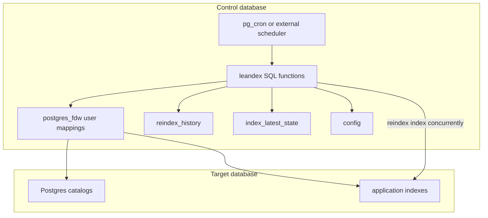

# leandex

[](https://github.com/NikolayS/leandex/actions/workflows/ci.yml)
[](https://github.com/NikolayS/leandex)
[](LICENSE)
[](#why-anti-extension)

Keep Postgres indexes lean: detect bloat, rebuild safely, and keep durable history of every reindex.

`leandex` is a conservative autonomous reindexer written in pure SQL / PL/pgSQL. It installs into a separate control database and reaches target databases through `postgres_fdw` and `dblink`. It only ever runs `reindex index concurrently`, and it never installs anything into your application databases.

## Contents

- [Why "anti-extension"](#why-anti-extension)
- [What leandex does](#what-leandex-does)
- [What leandex refuses to do](#what-leandex-refuses-to-do)
- [Quick start](#quick-start)
- [First dry run](#first-dry-run)
- [Safety model](#safety-model)
- [How it works](#how-it-works)
- [Configuration](#configuration)
- [Scheduling](#scheduling)
- [Comparison](#comparison)
- [Acknowledgements](#acknowledgements)
- [Documentation](#documentation)
- [License](#license)

## Why "anti-extension"

The reason is portability. A new C extension only helps the people whose Postgres provider has agreed to ship it. On RDS, Aurora, Cloud SQL, Azure, Supabase, Crunchy Bridge, and most managed platforms, that decision is not yours, the timeline is not yours, and historically it can take years — or never happen at all.

`leandex` sidesteps that loop entirely. It only depends on building blocks that are already available virtually everywhere Postgres runs:

- `postgres_fdw` and `dblink` — standard contrib extensions, allow-listed by every major managed provider;
- `pg_cron` for scheduling where it's available, or any external ticker (system cron, Kubernetes CronJob, GitHub Actions, Lambda, …) where it isn't;
- the `reindex index concurrently` command, built into Postgres since 12.

That means no waiting on a vendor to support a new extension, no `shared_preload_libraries` change, no Postgres restart, no background worker or sidecar daemon, and nothing installed inside your application databases. Just a single SQL file loaded once into one isolated control database, and a role with enough privileges to reindex on the targets.

This is the same posture as [`pg_ash`](https://github.com/NikolayS/pg_ash) and [`PgQue`](https://github.com/NikolayS/pgque): build on what's already in the box, so the tool runs wherever your databases run.

## What leandex does

- Detects index bloat with a lightweight baseline-ratio method.
- Rebuilds eligible indexes using `reindex index concurrently`.
- Records every attempt in `leandex.reindex_history` and the latest state in `leandex.index_latest_state`.
- Manages many target databases from one control database.
- Uses `postgres_fdw` user mappings instead of plaintext dblink connection strings.
- Schedules with `pg_cron` or any external scheduler.

## What leandex refuses to do

`leandex` does **not** drop indexes, suggest missing indexes, create replacement indexes, or rewrite table storage. Index creation and deletion are sharp knives; mixing them into automatic reindexing would muddy the safety story. The production target is deliberately narrow: **safe automatic reindexing**.

## Quick start

Requirements:

- Postgres 13+
- A control database (for example `leandex_control`)
- `postgres_fdw` and `dblink` installed in the control database (`pg_cron` optional, for in-database scheduling)
- A role with privileges to inspect indexes and run `reindex index concurrently` on targets

Install:

```bash
git clone https://github.com/NikolayS/leandex.git
cd leandex

createdb -h your_host -U your_user leandex_control
psql -h your_host -U your_user -d leandex_control
```

```sql
create extension if not exists postgres_fdw;
create extension if not exists dblink;
\i leandex.sql
```

Register one target:

```sql
create server target_your_database
  foreign data wrapper postgres_fdw
  options (host 'your_host', port '5432', dbname 'your_database');

create user mapping for current_user
  server target_your_database
  options (user 'your_user', password 'your_password');

insert into leandex.target_databases(database_name, host, port, fdw_server_name, enabled)
values ('your_database', 'your_host', 5432, 'target_your_database', true)
on conflict (database_name) do update
  set host = excluded.host,
      port = excluded.port,
      fdw_server_name = excluded.fdw_server_name,
      enabled = true;
```

Verify:

```sql
select * from leandex.check_fdw_security_status();
select * from leandex.check_environment();
```

Prefer `.pgpass`, `PGPASSWORD`, or a protected secret store over command-line passwords — they leak through shell history and process listings.

`leandex.sql` is the installation artifact. The split SQL files at the repository root exist for reviewable diffs during development.

## First dry run

Don't point a new automation loop at a hot production fleet and walk away.

Populate baseline state without rebuilding:

```sql
select leandex.do_force_populate_index_stats('appdb', 'public', null, null);
```

Inspect estimated bloat:

```sql
select datname, schemaname, relname, indexrelname,
       pg_size_pretty(indexsize) as index_size,
       estimated_bloat
from leandex.get_index_bloat_estimates('appdb')
order by estimated_bloat desc
limit 20;
```

Dry run (no rebuilds), then a real run:

```sql
call leandex.periodic(false);
call leandex.periodic(true);
```

Review history:

```sql
select * from leandex.history order by ts desc limit 20;
```

## Safety model

| Area | Approach |
| --- | --- |
| Rebuild method | `reindex index concurrently` only |
| Control plane | separate control database |
| Target DB footprint | nothing installed in target DBs |
| Credentials | `postgres_fdw` user mappings |
| Scope | reindex only — no drop, create, or advice |
| Timeouts | remote `lock_timeout` / `statement_timeout` set before reindex |
| History | every attempt recorded in `leandex.reindex_history` |
| Compatibility | Postgres 13–18 in CI; known-unsafe minors blocked |
| Uninstall | drops the `leandex` schema; FDW cleanup is opt-in |

What can still go wrong: `reindex index concurrently` still consumes IO, CPU, WAL, and temp disk; long transactions on the target delay it; aggressive thresholds can schedule more rebuild work than your maintenance window can absorb. And if you haven't tested restore, you don't have backups — that one's gravity, not `leandex`.

Recommended rollout: install, register one non-critical target, populate baseline, run `call leandex.periodic(false);` and inspect, lower thresholds in staging before production, then schedule.

## How it works



The control database is intentional: `reindex concurrently` cannot run inside a normal transaction block, and orchestrating from the database being reindexed is a fine way to manufacture deadlocks at 3am.

The bloat heuristic is intentionally simple — a baseline-ratio method on observed index size and estimated tuples — not a page-level forensic calculator. The goal is repeatable maintenance decisions, not perfect measurement.

See [docs/architecture.md](docs/architecture.md) for the full loop.

## Configuration

Settings live in `leandex.config`, scoped globally or per database / schema / table / index.

| Setting | Default | Meaning |
| --- | --- | --- |
| `index_size_threshold` | `10MB` | ignore smaller indexes unless forced by history |
| `index_rebuild_scale_factor` | `2` | rebuild when estimated bloat exceeds 2× baseline |
| `minimum_reliable_index_size` | `128kB` | avoid noisy estimates on tiny indexes |
| `reindex_history_retention_period` | `10 years` | how long to keep history |
| `lock_timeout` | `5s` | remote lock-wait guard before reindex |
| `statement_timeout` | `0` | remote statement timeout (0 disables) |

```sql
select leandex.set_or_replace_setting(
  _datname => 'appdb',
  _schemaname => null, _relname => null, _indexrelname => null,
  _key => 'index_rebuild_scale_factor',
  _value => '1.3',
  _comment => 'Rebuild at 30% above baseline'
);
```

## Scheduling

With `pg_cron`:

```sql
select cron.schedule_in_database(
  'leandex-maintenance',
  '0 3 * * *',
  'call leandex.periodic(true);',
  'leandex_control'
);
```

With external cron:

```bash
PGPASSWORD='your_password' psql \
  -h your_host -U your_user -d leandex_control \
  -c "call leandex.periodic(true);"
```

Start with `periodic(false)` until candidates look sane, run during a real maintenance window, watch WAL, replica lag, IO, and lock waits, and expand scope gradually. To pause everything globally, set `skip_index_rebuild` to `true` (see [docs/runbook.md](docs/runbook.md)).

## Comparison

| Tool | Concurrent rebuild | History | Multi-DB | No target-DB objects | Managed-PG friendly |
| --- | :---: | :---: | :---: | :---: | :---: |
| manual SQL / cron scripts | if careful | usually no | no | yes | yes |
| `pg_repack` | yes | no | no | no | often blocked |
| `pgstattuple` | n/a (measurement) | no | no | no | often restricted |
| postgres-checkup | n/a (reporting) | report | external | yes | yes |
| **leandex** | **yes** | **yes** | **yes** | **yes** | **designed for it** |

`pg_repack` is excellent when available and when you need table rewrites; many managed environments make it awkward or impossible. `pgstattuple` is a measurement tool, not an automation framework. postgres-checkup is for analysis and reporting. `leandex` does one execution-side job and intentionally avoids index recommendations.

## Acknowledgements

The bloat detection in `leandex` is based on Maxim Boguk's index bloat formula, originally implemented in `pg_index_watch`. That idea is the reason `leandex` can use a lightweight baseline-ratio method instead of heavier scans or btree-only estimates.

## Documentation

- [Installation](docs/installation.md)
- [Runbook](docs/runbook.md) — pause/resume, troubleshooting, history queries
- [FAQ](docs/faq.md)
- [Function reference](docs/function_reference.md)
- [Architecture](docs/architecture.md)
- [Contributing](CONTRIBUTING.md)

To uninstall, run `\i uninstall.sql` in the control database. It drops the `leandex` schema and intentionally leaves FDW servers and user mappings alone — those may be shared infrastructure.

## License

BSD 3-Clause.
