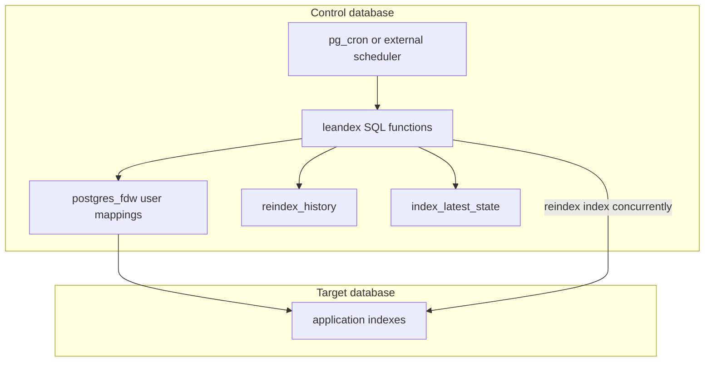

# leandex

Keep Postgres indexes lean: detect bloat, rebuild safely, and keep a durable history of reindexing.

`leandex` is an early-stage, DBA-first tool for autonomous reindexing. The production target is deliberately narrow: **safe automatic reindexing** using `reindex index concurrently`, with the control plane stored inside Postgres.

The SQL schema is `leandex`; this extraction intentionally does a full rename while the project is still pre-adoption.

## Status

Early development. Useful for experiments and controlled environments; not yet a fire-and-forget production daemon.

## What leandex does now

- Detects index bloat using a lightweight baseline-ratio method.
- Rebuilds bloated indexes with `reindex index concurrently`.
- Stores maintenance history and latest observed index state.
- Runs from a separate control database to avoid reindexing from the target database session.
- Supports multiple target databases through `postgres_fdw` and `dblink`.
- Can be scheduled with `pg_cron` or triggered externally.
- Works without installing objects into target databases.

## Non-goals for now

`leandex` does **not** drop indexes and does **not** suggest new indexes.

That work belongs in separate, heavily gated tools. Index creation and deletion are sharp knives; mixing them into reindexing now would make the safety story muddy.

## Why this exists

Postgres index bloat is boring until it burns IO, cache, replication lag, and maintenance windows. Manual reindexing does not scale across fleets, and naïve automation is dangerous.

`leandex` aims to be the conservative middle ground: automate the boring work, keep the operator in control, and make every action explainable.

## Safety model

| Area | Current approach |
| --- | --- |
| Rebuild method | `reindex index concurrently` only |
| Control plane | separate `leandex_control` database |
| Target DB footprint | no schema installed in target DBs |
| Credentials | `postgres_fdw` user mappings; avoid plaintext dblink strings |
| Scope | reindexing only |
| Locking | avoids same-database reindex orchestration to reduce deadlock risk |
| History | every reindex attempt is recorded in `leandex.reindex_history` |
| Compatibility | Postgres 13+; known unsafe minor releases are blocked |

## Requirements

- Postgres 13 or newer.
- Ability to create a control database.
- Extensions in the control database:
  - `postgres_fdw`
  - `dblink`
  - `pg_cron` optional, only for in-database scheduling.
- A role with enough privileges to inspect indexes and run `reindex index concurrently` on target indexes.

Managed Postgres support depends on extension availability and `create database` permissions. RDS/Aurora and Supabase are known target environments; Cloud SQL, Azure, and Crunchy Bridge need dedicated validation before we should brag.

## Quick start

```bash
git clone https://github.com/NikolayS/leandex.git
cd leandex

# 1. Install leandex into a control database.
PGPASSWORD='your_password' \
  ./leandex install-control \
  -H your_host -U your_user -C leandex_control

# 2. Register a target database.
PGPASSWORD='your_password' \
  ./leandex register-target \
  -H your_host -U your_user -C leandex_control \
  -T your_database --fdw-host your_host

# 3. Verify installation, permissions, FDW security, and environment.
PGPASSWORD='your_password' \
  ./leandex verify \
  -H your_host -U your_user -C leandex_control
```

Prefer `PGPASSWORD` or a password file over `-W/--password`; command-line passwords leak through shell history and process listings. Ask me how I know. Actually, don't.

### Single-file SQL install

If you prefer plain `psql`, use the bundled installer:

```bash
psql -h your_host -U your_user -d leandex_control -f leandex.sql
```

The `./leandex install-control` command uses `leandex.sql` when present and falls back to the split SQL files only for development.

## Basic operation

Populate index state without rebuilding:

```sql
select leandex.do_force_populate_index_stats('appdb', 'public', null, null);
```

Check estimated bloat:

```sql
select *
from leandex.get_index_bloat_estimates('appdb')
order by estimated_bloat desc;
```

Run one maintenance cycle in dry-run style (`false` means do not rebuild):

```sql
call leandex.periodic(false);
```

Run one maintenance cycle that may rebuild eligible indexes:

```sql
call leandex.periodic(true);
```

View history:

```sql
select *
from leandex.history
order by ts desc
limit 20;
```

## Architecture



The control database is intentional. `reindex concurrently` cannot run inside a normal transaction block, and running orchestration from the same database being reindexed is a fine way to manufacture deadlocks at 3am.

## Comparison

| Tool / approach | Detect bloat | Rebuild concurrently | Multi-DB control plane | Managed Postgres friendly | Drops/suggests indexes |
| --- | ---: | ---: | ---: | ---: | ---: |
| manual SQL scripts | yes | if careful | no | yes | manual |
| `pg_repack` | partial | yes | no | often no superuser problem | no |
| `pgstattuple` checks | yes | no | no | often restricted | no |
| postgres-checkup | yes | no | external report | yes | no |
| leandex | yes | yes | yes | designed for it | no |

## Configuration

Settings live in `leandex.config` and can be scoped globally, by database, schema, table, or index.

Example:

```sql
select leandex.set_or_replace_setting(
  _datname => 'appdb',
  _schemaname => null,
  _relname => null,
  _indexrelname => null,
  _key => 'index_rebuild_scale_factor',
  _value => '1.3',
  _comment => 'Rebuild when index size per tuple grows 30% above baseline'
);
```

## Scheduling

With `pg_cron`:

```sql
select cron.schedule_in_database(
  'leandex-maintenance',
  '0 3 * * *',
  'call leandex.periodic(true);',
  'leandex_control'
);
```

With external cron:

```bash
PGPASSWORD='your_password' psql \
  -h your_host -U your_user -d leandex_control \
  -c "call leandex.periodic(true);"
```

## Repository layout

```text
.
├── leandex                     # installer / admin CLI
├── leandex.sql                 # single-file SQL installer
├── leandex_tables.sql      # split SQL: schema and tables
├── leandex_functions.sql   # split SQL: core logic
├── leandex_fdw.sql         # split SQL: FDW/dblink helpers
├── uninstall.sql
├── docs/
├── test/
└── ci/
```

`leandex.sql` is the user-facing installer. The split SQL files stay at repository root for reviewable diffs and development.

## Tests

Local test run against an existing Postgres:

```bash
PGPASSWORD=postgres ./test/run_tests.sh \
  -h 127.0.0.1 -p 5432 -u postgres -w postgres -d test_leandex
```

GitHub Actions runs:

- shell formatting and shellcheck;
- SQL security grep checks;
- test suite on Postgres 13, 14, 15, 16, 17, and 18;
- installer verification on Postgres 13 through 18;
- e2e bloat reduction scenario on Postgres 18 as the primary gate.

## Documentation

- [Installation](docs/installation.md)
- [Runbook](docs/runbook.md)
- [FAQ](docs/faq.md)
- [Function reference](docs/function_reference.md)
- [Architecture](docs/architecture.md)
- [Installer CLI reference](docs/installer_cli_reference.md)

## Uninstall

```bash
PGPASSWORD='your_password' \
  ./leandex uninstall \
  -H your_host -U your_user -C leandex_control --drop-servers
```

Or manually:

```sql
\i uninstall.sql
```

## License

Apache 2.0.
